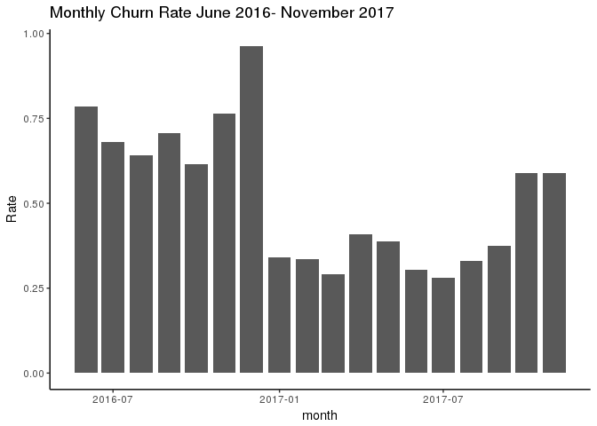

Churn Rate
================

What's the system's churn rate?
===============================

``` r
In <- read_csv("~/nomadic-herders/LTSdata/In.csv") 
```

    ## Warning: Missing column names filled in: 'X1' [1]

    ## Parsed with column specification:
    ## cols(
    ##   X1 = col_integer(),
    ##   id = col_integer(),
    ##   Date = col_date(format = ""),
    ##   Time = col_datetime(format = ""),
    ##   Type = col_character(),
    ##   Message = col_character(),
    ##   correct = col_character(),
    ##   area = col_integer()
    ## )

``` r
In <- In %>%
  select(-X1)

first_use <- In %>%
  mutate(month = month(Date), year = year(Date)) %>%
  group_by(id) %>%
  arrange(month, year) %>%
  slice(1) %>%
  ungroup() %>%
  group_by(month, year) %>%
  summarise(n = n()) %>%
  arrange(year)

total_use <- In %>%
  mutate(month = month(Date), year = year(Date)) %>%
  group_by(month, year) %>%
  distinct(id, .keep_all = TRUE) %>%
  summarise(total = n()) %>%
  arrange(year)

left_join(first_use, total_use, by = c("year" = "year", "month" = "month")) %>%
  mutate(churn = n/total)
```

    ## # A tibble: 19 x 5
    ## # Groups:   month [12]
    ##    month  year     n total churn
    ##    <dbl> <dbl> <int> <int> <dbl>
    ##  1  6.00  2016  3334  3474 0.960
    ##  2  7.00  2016   550  1008 0.546
    ##  3  8.00  2016   266   611 0.435
    ##  4  9.00  2016   338   635 0.532
    ##  5 10.0   2016   384   706 0.544
    ##  6 11.0   2016  1697  2387 0.711
    ##  7 12.0   2016  1725  3047 0.566
    ##  8  1.00  2017  1581  1581 1.00 
    ##  9  2.00  2017   556  1040 0.535
    ## 10  3.00  2017   557  1080 0.516
    ## 11  4.00  2017   597  1190 0.502
    ## 12  5.00  2017   288   838 0.344
    ## 13  6.00  2017   114   439 0.260
    ## 14  7.00  2017    83   348 0.239
    ## 15  8.00  2017   129   375 0.344
    ## 16  9.00  2017   155   402 0.386
    ## 17 10.0   2017   441   761 0.580
    ## 18 11.0   2017   293   641 0.457
    ## 19 12.0   2017   151   435 0.347

``` r
last_use <- In %>% 
  mutate(month = month(Date), year = year(Date)) %>%
  group_by(id) %>%
  arrange(month, year) %>%
  slice(n()) %>%
  ungroup() %>%
  group_by(month, year) %>%
  summarise(n = n()) %>%
  arrange(year)

left_join(last_use, total_use, by = c("year" = "year", "month" = "month")) %>%
  mutate(churn = n/total)
```

    ## # A tibble: 19 x 5
    ## # Groups:   month [12]
    ##    month  year     n total churn
    ##    <dbl> <dbl> <int> <int> <dbl>
    ##  1  6.00  2016  2731  3474 0.786
    ##  2  7.00  2016   686  1008 0.681
    ##  3  8.00  2016   392   611 0.642
    ##  4  9.00  2016   448   635 0.706
    ##  5 10.0   2016   435   706 0.616
    ##  6 11.0   2016  1826  2387 0.765
    ##  7 12.0   2016  2937  3047 0.964
    ##  8  1.00  2017   539  1581 0.341
    ##  9  2.00  2017   350  1040 0.337
    ## 10  3.00  2017   314  1080 0.291
    ## 11  4.00  2017   487  1190 0.409
    ## 12  5.00  2017   326   838 0.389
    ## 13  6.00  2017   133   439 0.303
    ## 14  7.00  2017    98   348 0.282
    ## 15  8.00  2017   124   375 0.331
    ## 16  9.00  2017   151   402 0.376
    ## 17 10.0   2017   449   761 0.590
    ## 18 11.0   2017   378   641 0.590
    ## 19 12.0   2017   435   435 1.00

``` r
left_join(last_use, total_use, by = c("year" = "year", "month" = "month")) %>%
  mutate(churn = n/total) %>%
  ungroup() %>%
  filter(!row_number() == n()) %>%
  mutate(date = make_date(year = year, month = month)) %>%
ggplot(aes(x = date, y = churn)) + geom_col() + labs(title = "Monthly Churn Rate June 2016- November 2017", y = "Rate", x = "month") + theme(panel.grid.major = element_blank(), panel.grid.minor = element_blank(), panel.background = element_blank(),  axis.line = element_line(colour = "black")) 
```


