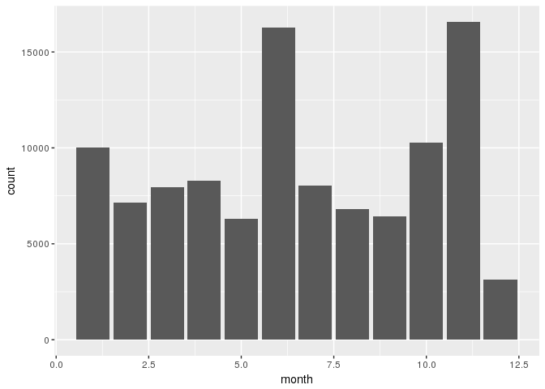
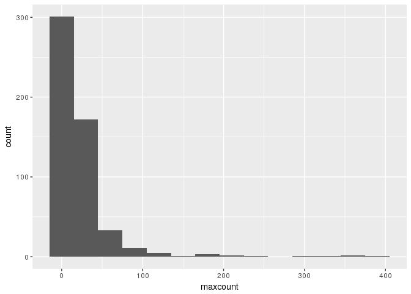
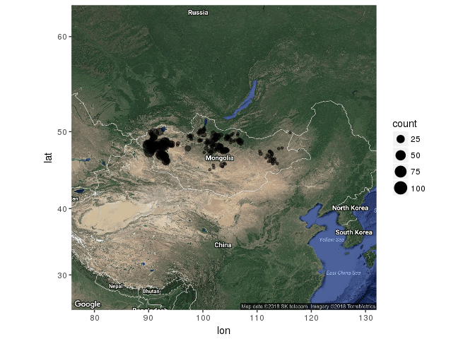

Data Exploration
================
Giovanni Corti
4/5/2018

``` r
library(ggplot2)
library(lubridate)
```

    ## 
    ## Attaching package: 'lubridate'

    ## The following object is masked from 'package:base':
    ## 
    ##     date

``` r
library(tidyverse)
```

    ## ── Attaching packages ─────────────────────────────────────── tidyverse 1.2.1 ──

    ## ✔ tibble  1.4.1     ✔ purrr   0.2.4
    ## ✔ tidyr   0.7.2     ✔ dplyr   0.7.4
    ## ✔ readr   1.1.1     ✔ stringr 1.3.0
    ## ✔ tibble  1.4.1     ✔ forcats 0.2.0

    ## ── Conflicts ────────────────────────────────────────── tidyverse_conflicts() ──
    ## ✖ lubridate::as.difftime() masks base::as.difftime()
    ## ✖ lubridate::date()        masks base::date()
    ## ✖ dplyr::filter()          masks stats::filter()
    ## ✖ lubridate::intersect()   masks base::intersect()
    ## ✖ dplyr::lag()             masks stats::lag()
    ## ✖ lubridate::setdiff()     masks base::setdiff()
    ## ✖ lubridate::union()       masks base::union()

``` r
library(ggmap)
library(reshape)
```

    ## 
    ## Attaching package: 'reshape'

    ## The following object is masked from 'package:dplyr':
    ## 
    ##     rename

    ## The following objects are masked from 'package:tidyr':
    ## 
    ##     expand, smiths

    ## The following object is masked from 'package:lubridate':
    ## 
    ##     stamp

``` r
df1<-read.csv("data/LTS_deidentified.csv",stringsAsFactors=FALSE)

zipdata<-read.csv("data/Zip_Coords.csv", header=FALSE, col.names=c("Name", "Zip", "Lat","Long", "Pasture"), colClasses = c("character", "integer", "numeric", "numeric", "character"))

mutate(df1, month=month(Date)) %>%
  ggplot(aes(x=month))+geom_bar()
```



``` r
mutate(df1, month=month(Date)) %>%
  group_by(id) %>%
  summarize(mindate=min(Date), maxdate=max(Date)) %>%
  group_by(maxdate) %>%
  summarize(maxcount=n()) %>%
  ggplot(aes(x=maxcount))+geom_bar(binwidth = 30)
```

    ## Warning: `geom_bar()` no longer has a `binwidth` parameter. Please use
    ## `geom_histogram()` instead.



``` r
strsplit(df1$Message[[3]], " ")[[1]][[1]]
```

    ## [1] "3sar31:"

``` r
df2<-filter(df1, Type=="in") %>%
  mutate(Zip=as.numeric(substr(Message,0,5))) %>%
  inner_join(zipdata, by=c("Zip"="Zip")) %>%
  mutate(Pasture=ifelse(Pasture=="pasture",TRUE, FALSE)) %>%
  group_by(Zip) %>%
  summarize(count=n(), lat=mean(Lat), long=mean(Long))
```

    ## Warning in evalq(as.numeric(substr(Message, 0, 5)), <environment>): NAs
    ## introduced by coercion

``` r
m <- get_map("Mongolia", zoom = 4, maptype = "hybrid")
```

    ## Map from URL : http://maps.googleapis.com/maps/api/staticmap?center=Mongolia&zoom=4&size=640x640&scale=2&maptype=hybrid&language=en-EN&sensor=false

    ## Information from URL : http://maps.googleapis.com/maps/api/geocode/json?address=Mongolia&sensor=false

``` r
ggmap(m) +
  geom_point(data = df2, aes(x = long, y = lat, size=count, alpha=.05))+ guides(alpha=FALSE)
```


