Error & Else
================
Wenxin Du
5/3/2018

``` r
library(tidyr)
library(dplyr)
library(ggplot2)
library(lubridate)
library(readr)
library(readxl)
```

``` r
JunSep16 <- read_excel("~/nomadic-herders/LTSdata/2016JunToSep.xls")
OctNov16 <- read_excel("~/nomadic-herders/LTSdata/2016OctNov.xlsx")
Apr17 <- read_excel("~/nomadic-herders/LTSdata/2017Apr.xlsx")
AugSep17 <- read_excel("~/nomadic-herders/LTSdata/2017AugSep.xlsx")
Dec17 <- read_excel("~/nomadic-herders/LTSdata/2017Dec.xlsx")
JanMar17 <- read_excel("~/nomadic-herders/LTSdata/2017JanToMar.xlsx")
Jul17 <- read_excel("~/nomadic-herders/LTSdata/2017Jul.xlsx")
Jun17 <-read_excel("~/nomadic-herders/LTSdata/2017Jun.xlsx")
May17 <- read_excel("~/nomadic-herders/LTSdata/2017May.xlsx")
OctDec17 <- read_excel("~/nomadic-herders/LTSdata/2017OctDec.xlsx")
X2016_Dec <- read_excel("~/nomadic-herders/LTSdata/2016 Dec.xlsx")
```

``` r
JunSep16 <- JunSep16 %>%
  mutate(Number = as.numeric(substr(Number, 2, 100)))
OctNov16 <- OctNov16 %>%
  mutate(Number = as.numeric(Number), Name = as.numeric(Name))
Jul17 <- Jul17 %>%
  mutate(Name = as.numeric(Name))
LTS <- bind_rows(Apr17, AugSep17, Dec17, JanMar17, Jul17, Jun17, JunSep16, May17, OctDec17, OctNov16, X2016_Dec)
LTS <- select(LTS, Date, Time, Type, Number, Message)
```

``` r
LTS <- LTS %>%
  mutate(Number = ifelse(nchar(as.character(Number)) == 11, Number %% 100000000, Number),
         Number = ifelse(nchar(as.character(Number)) == 10, Number %% 10000000, Number))
```

``` r
n <- LTS %>%
  distinct(Number)
nl <- as.vector(n$Number)
nr <- n %>%
  nrow()
```

``` r
set.seed(111)
id_ <- sample(10000:99999, nr, replace=FALSE)
id <- floor(runif(nr, min = 10000, max = 99999)) ###wrong code, not truly distinct numbers generated
```

``` r
identifier <- data.frame(nl, id_) %>%
  mutate(Number = nl, id = id_) %>%
  select(Number, id)
```

``` r
LTS_deidentified_1_ <- read_csv("~/nomadic-herders/data/LTS_deidentified (1).csv")
In_4_ <- read_csv("~/nomadic-herders/LTSdata/In (6).csv")
LTS_yearmonth <-  LTS_deidentified_1_ %>%
  mutate(Date = ymd(Date)) %>%
  mutate(Year = year(Date), month = month(Date)) %>%
  mutate(month = ifelse(nchar(as.character(month)) == 1, paste("0", sep = "", as.character(month)), as.character(month))) %>%
  mutate(year_month = paste(as.character(Year), "-", month)) 
```

### Distribution of Unique Users over Time

``` r
LTS_yearmonth %>%
  group_by(year_month) %>%
  distinct(id) %>%
  summarize(n = n()) %>%
  arrange(desc(n)) %>%
  ggplot(aes(x = year_month, y = n)) +
  geom_col() +
  theme(axis.text.x = element_text(angle = 40, hjust = 1)) +
  ggtitle("Number of Unique Users over Time") +
  xlab("Year-Month") +
  ylab("Number of Unique users")
```

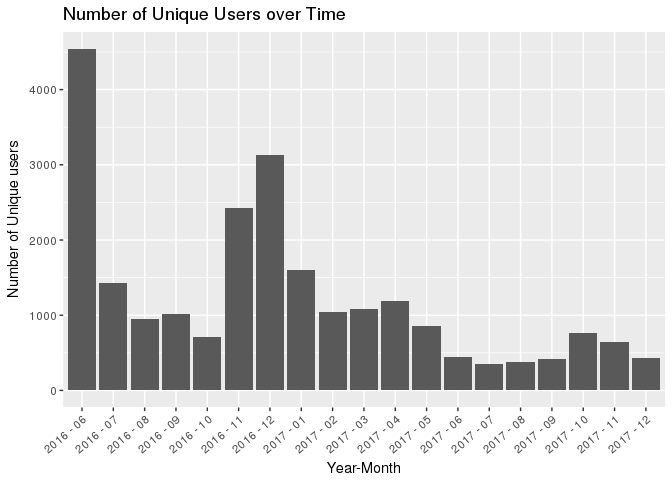

### Distribution of Odd Telephone Numbers Over Time

#### Odd telephone numbers: phone numbers less than 8 digits

``` r
odd_phone_numbers <- left_join(LTS, identifier) %>%
  filter(nchar(as.character(Number)) != 8) %>%
  distinct(id) %>%
  mutate(is_odd = TRUE)
a <- full_join(LTS_yearmonth, odd_phone_numbers) %>%
  mutate(is_odd = ifelse(!is.na(is_odd), TRUE, FALSE))
a %>%
  group_by(year_month, is_odd) %>%
  distinct(id) %>%
  summarize(n = n()) %>%
  ggplot(aes(x = year_month, y = n, fill = is_odd)) + 
  geom_col()+
  theme(axis.text.x = element_text(angle = 40, hjust = 1))
```


``` r
a %>% 
  group_by(year_month, is_odd) %>%
  distinct(id) %>%
  summarize(n = n()) %>%
  mutate(prop = n/sum(n)) %>%
  ggplot(aes(x = year_month, y = prop, fill = is_odd)) + 
  geom_col()+
  theme(axis.text.x = element_text(angle = 40, hjust = 1)) +
  scale_fill_manual(values = c("white", "gray"))
```

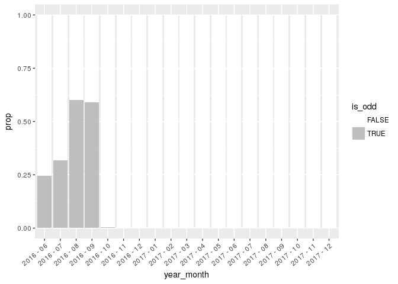

### Create a list of IDs who sent in requests but never hear back from the system

``` r
never_hear_back <- LTS_yearmonth %>%
  group_by(id, Type) %>%
  summarize(n = n()) %>%
  spread(key = Type, value = n) %>%
  filter(is.na(out)) %>%
  arrange(desc(`in`)) 
nhb <- as.vector(never_hear_back$id)
```

``` r
In <- In_4_ %>%
  mutate(date = ymd(Date)) %>%
  select(-Date) %>%
  rename(Date = date)
```

### Distribution of messages sent in messages with correct area code and correct format but never hear back over time

``` r
bb <- In %>%
  mutate(Date = ymd(Date)) %>%
  mutate(Year = year(Date), month = month(Date)) %>%
  mutate(month = ifelse(nchar(as.character(month)) == 1, paste("0", sep = "", as.character(month)), as.character(month))) %>%
  mutate(year_month = paste(as.character(Year), "-", month)) 
```

``` r
pattern <- "^[0-9]{5}\\s+[0-9]{1}$"
bb <- bb %>%
  mutate(correct = grepl(pattern, Message))
bb %>%
  group_by(correct) %>%
  summarize(n = n())
```

    ## # A tibble: 2 x 2
    ##   correct     n
    ##   <lgl>   <int>
    ## 1 F        9162
    ## 2 T       52454

``` r
bb %>%
  group_by(year_month) %>%
  filter(id %in% nhb) %>%
  filter(correct == TRUE) %>%
  filter(area_correct == "real") %>%
  group_by(area_correct, year_month) %>%
  summarize(n = n()) %>%
  ggplot(aes(x = year_month, y = n)) + 
  geom_col(position = "dodge") +
  theme(axis.text.x = element_text(angle = 40, hjust = 1))
```

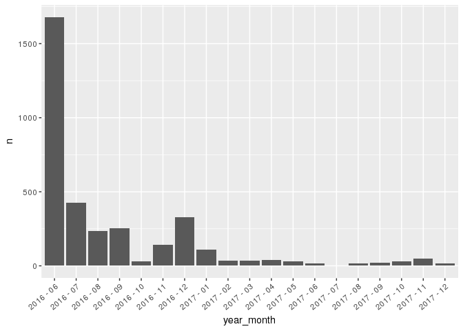

### Distribution of messages with area code not existing

``` r
bb %>%
  group_by(year_month) %>%
  filter(area_correct == "fake") %>%
  group_by(area_correct, year_month) %>%
  summarize(n = n()) %>%
  ggplot(aes(x = year_month, y = n)) + 
  geom_col(position = "dodge") +
  theme(axis.text.x = element_text(angle = 40, hjust = 1))
```

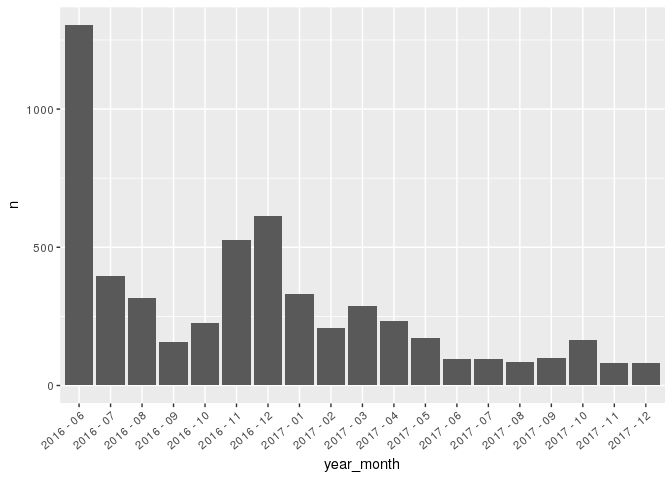

### Distribution of messages with area code not existing from users who never hear back

``` r
bb %>%
  group_by(year_month) %>%
  filter(id %in% nhb) %>%
  filter(area_correct == "fake") %>%
  group_by(area_correct, year_month) %>%
  summarize(n = n()) %>%
  ggplot(aes(x = year_month, y = n)) + 
  geom_col(position = "dodge") +
  theme(axis.text.x = element_text(angle = 40, hjust = 1))
```

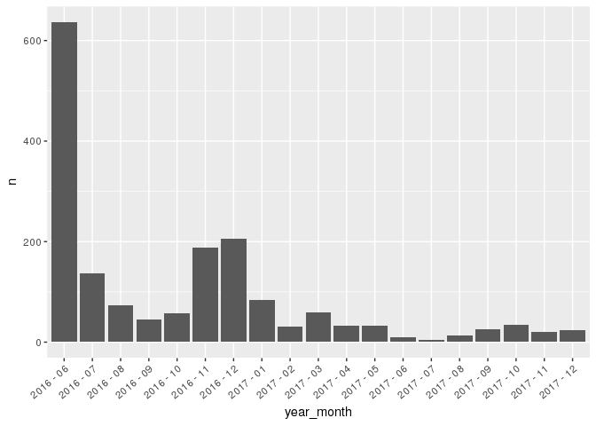

### Distribution of messages from those who never hear back

``` r
bb %>%
  group_by(year_month) %>%
  filter(id %in% nhb) %>%
  filter(correct == TRUE) %>%
  group_by(area_correct, year_month) %>%
  summarize(n = n()) %>%
  ggplot(aes(x = year_month, y = n, fill = area_correct)) + 
  geom_col(position = "dodge") +
  theme(axis.text.x = element_text(angle = 40, hjust = 1))
```

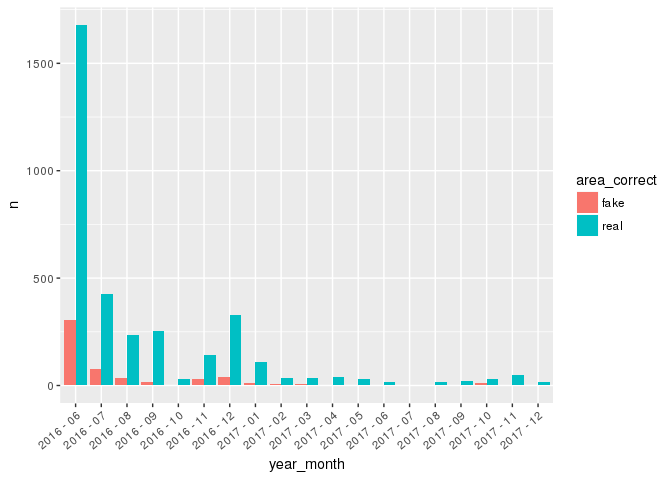

### Distribution of number of requests for top 6 most popular area codes

``` r
area <- bb %>%
  filter(area_correct == "real", !is.na(area)) %>%
  group_by(area) %>%
  summarize(n = n()) %>%
  arrange(desc(n)) %>%
  head(6)
area
```

    ## # A tibble: 6 x 2
    ##    area     n
    ##   <int> <int>
    ## 1 62267  1149
    ## 2 84217  1014
    ## 3 46135   877
    ## 4 67179   770
    ## 5 23177   646
    ## 6 62110   547

``` r
qwq <- as.vector(area$area)
qqq <- bb %>%
  mutate(area = as.character(area)) %>%
  group_by(area, area_correct, year_month) %>%
  filter(area %in% qwq) %>%
  filter(area_correct == "real") %>%
  summarize(n = n()) %>%
  arrange(desc(n))
```

``` r
qqq$code = factor(qqq$area, levels = c(62267, 84217, 46135, 67179, 23177, 62110))
qqq
```

    ## # A tibble: 93 x 5
    ## # Groups:   area, area_correct [6]
    ##    area  area_correct year_month     n code 
    ##    <chr> <chr>        <chr>      <int> <fct>
    ##  1 46135 real         2016 - 12    209 46135
    ##  2 62267 real         2016 - 12    196 62267
    ##  3 67179 real         2016 - 12    163 67179
    ##  4 62267 real         2017 - 03    143 62267
    ##  5 62267 real         2017 - 04    131 62267
    ##  6 62267 real         2017 - 05    129 62267
    ##  7 84217 real         2016 - 11    128 84217
    ##  8 46135 real         2017 - 01    127 46135
    ##  9 67179 real         2017 - 01    122 67179
    ## 10 23177 real         2017 - 04    116 23177
    ## # ... with 83 more rows

``` r
qqq%>%
  ggplot(aes(x = year_month, y = n)) + geom_col(position = "dodge") +
  facet_wrap(~code, ncol = 2) +
  theme(axis.text.x = element_text(angle = 70, hjust = 1))+ 
  theme(panel.grid.major = element_blank(), panel.grid.minor = element_blank(),
    panel.background = element_blank(), axis.line = element_blank()) +
    ggtitle("Top 6 Most Often Requested Area Codes") 
```

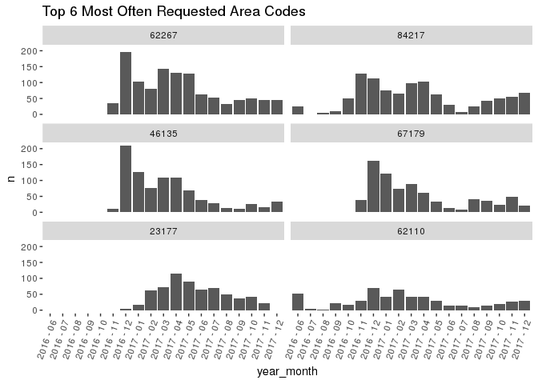

### Distribution of New Users

``` r
new_users <- bb %>%
  group_by(id) %>%
  summarize(min = min(Date)) %>%
  mutate(Year = year(min), month = month(min)) %>%
  mutate(month = ifelse(nchar(as.character(month)) == 1, paste("0", sep = "", as.character(month)), as.character(month))) %>%
  mutate(year_month = paste(as.character(Year), "-", month))%>%
  group_by(year_month) %>%
  summarize(n = n()) 
new_users %>%
  ggplot(aes(x = year_month, y = n)) + geom_col() +
  theme(axis.text.x = element_text(angle = 40, hjust = 1)) +
  ggtitle("Number of New Users Each Month") +
  xlab("Year-Month") +
  ylab("Number of New Users") +
    theme(panel.grid.major = element_blank(), panel.grid.minor = element_blank(), panel.background = element_blank())
```

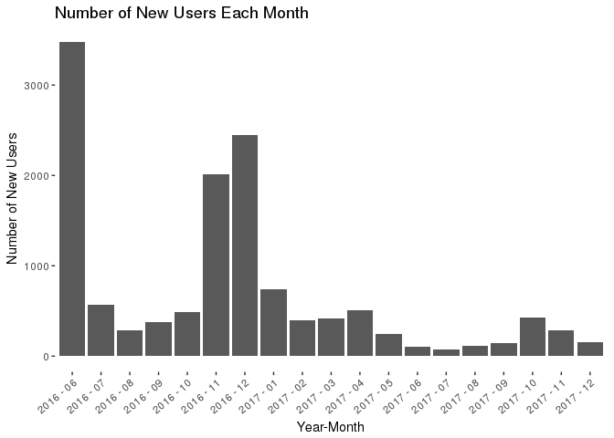

### Distribution of proportion of new users each month

``` r
bb %>%
  group_by(year_month) %>%
  distinct(id) %>%
  summarize(nid = n()) %>%
  full_join(new_users, by = "year_month") %>%
  mutate(prop = n/nid) %>%
  ggplot(aes(x = year_month, y = prop)) + geom_col() + theme(axis.text.x = element_text(angle = 40, hjust = 1))
```

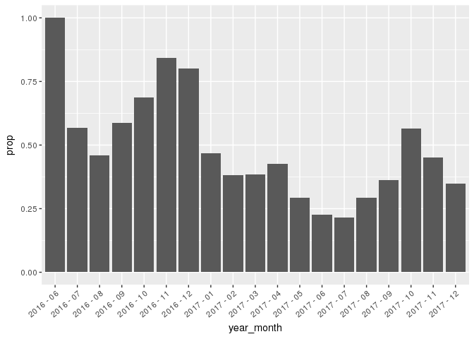

### Distribution of new users each month (includes whether they dropped within the same month)

``` r
gg <- bb %>%
  group_by(id) %>%
  summarize(min = min(Date), max = max(Date)) %>%
  mutate(Yearmin = year(min), monthmin = month(min), Yearmax = year(max), monthmax = month(max)) %>%
  mutate(monthmin = ifelse(nchar(as.character(monthmin)) == 1, paste("0", sep = "", as.character(monthmin)), as.character(monthmin))) %>%
  mutate(monthmax = ifelse(nchar(as.character(monthmax)) == 1, paste("0", sep = "", as.character(monthmax)), as.character(monthmax))) %>%
  mutate(year_month_min = paste(as.character(Yearmin), "-", monthmin))%>%
  mutate(year_month_max = paste(as.character(Yearmax), "-", monthmax))%>%
  mutate(drop_same_month = year_month_min == year_month_max) %>%
  group_by(year_month_min, drop_same_month) %>%
  summarize(n = n()) 
gg %>%
  ggplot(aes(x = year_month_min, y = n, fill = drop_same_month)) + geom_col() +
  theme(axis.text.x = element_text(angle = 40, hjust = 1))
```

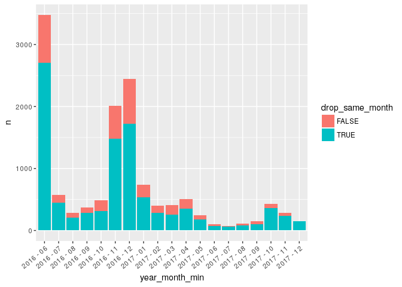

``` r
gg %>%
  filter(year_month_min != "2017 - 12") %>%
  group_by(year_month_min) %>%
  mutate(prop = n/sum(n)) %>%
  ggplot(aes(x = year_month_min, y = prop, fill = drop_same_month))+geom_col()+
  theme(axis.text.x = element_text(angle = 40, hjust = 1))
```

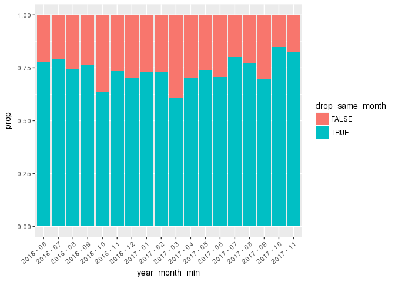

### Distribution of Those occured only once

``` r
c <- LTS_yearmonth %>%
  group_by(id) %>%
  summarize(n = n()) %>%
  filter(n == 1) 
d <- as.vector(c$id)
LTS_yearmonth %>%
  mutate(only_once = ifelse(id %in% d, TRUE, FALSE))%>%
  mutate(out_only_once = ifelse(only_once == TRUE & Type == "out", TRUE, FALSE)) %>%
  group_by(year_month, only_once) %>%
  distinct(id) %>%
  summarize(n = n()) %>%
  arrange(desc(n)) %>%
  ggplot(aes(x = year_month, y = n, fill = only_once)) +
  geom_col() +
  theme(axis.text.x = element_text(angle = 40, hjust = 1))
```

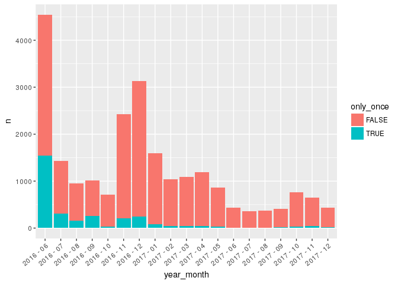

``` r
LTS_yearmonth %>%
  mutate(only_once = ifelse(id %in% d, TRUE, FALSE))%>%
  mutate(out_only_once = ifelse(only_once == TRUE & Type == "out", TRUE, FALSE)) %>%
  group_by(year_month, only_once) %>%
  distinct(id) %>%
  summarize(n = n()) %>%
  group_by(year_month) %>%
  mutate(prop = n/sum(n)) %>%
  ggplot(aes(x = year_month, y = prop, fill = only_once)) +
  geom_col() +
  theme(axis.text.x = element_text(angle = 40, hjust = 1)) 
```

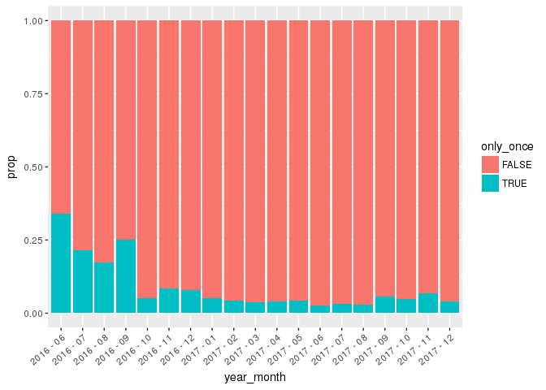

``` r
LTS_yearmonth %>%
  mutate(only_once = ifelse(id %in% d, TRUE, FALSE))%>%
  mutate(out_in = ifelse(only_once == TRUE & Type == "out", "ONCE OUT", ifelse(only_once == TRUE & Type == "in", "ONCE IN", "MORE THAN ONCE"))) %>%
  group_by(year_month, out_in) %>%
  distinct(id) %>%
  summarize(n = n()) %>%
  group_by(year_month) %>%
  mutate(prop = n/sum(n)) %>%
  ggplot(aes(x = year_month, y = prop, fill = out_in)) +
  geom_col() +
  theme(axis.text.x = element_text(angle = 40, hjust = 1)) +
  scale_fill_manual(values=c("mistyrose2", "lightskyblue", "lightcoral"))
```

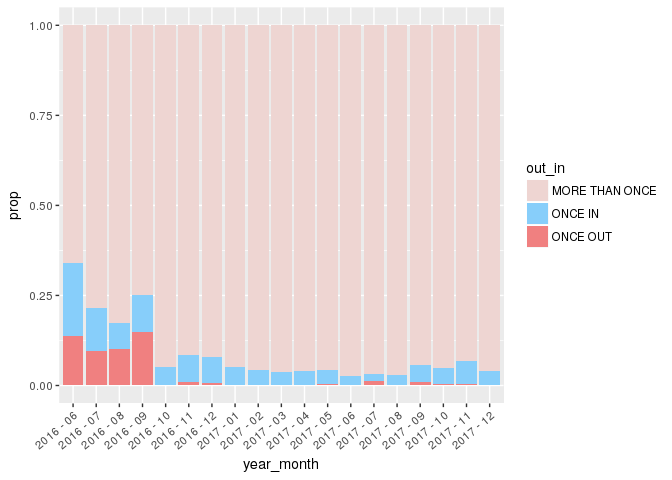

``` r
poor_guy <- bb %>% filter(id %in% nhb) %>% group_by(id) %>% summarize(n = n()) %>% arrange(desc(n)) %>% head(1) %>% select(id) %>% as.numeric()
poor_guy
```

    ## [1] 22818

``` r
bb %>%
  filter(id == poor_guy) %>%
  group_by(correct, area_correct) %>%
  summarize(n = n())
```

    ## # A tibble: 2 x 3
    ## # Groups:   correct [?]
    ##   correct area_correct     n
    ##   <lgl>   <chr>        <int>
    ## 1 T       fake            14
    ## 2 T       real            69

``` r
bb %>%
  filter(id %in% nhb) %>%
  group_by(id) %>%
  mutate(min = min(Date), max = max(Date), period = max - min) %>%
  group_by(period) %>%
  summarize(n = n()) %>%
  mutate(prop = n/sum(n))
```

    ## # A tibble: 114 x 3
    ##    period     n    prop
    ##    <time> <int>   <dbl>
    ##  1 0       3708 0.597  
    ##  2 1        254 0.0409 
    ##  3 2        138 0.0222 
    ##  4 3        154 0.0248 
    ##  5 4         86 0.0139 
    ##  6 5        110 0.0177 
    ##  7 6        105 0.0169 
    ##  8 7         61 0.00982
    ##  9 8         61 0.00982
    ## 10 9         78 0.0126 
    ## # ... with 104 more rows

``` r
bb %>%
  mutate(all_correct = ifelse(correct == TRUE & area_correct == "real", T, F)) %>%
  group_by(year_month, all_correct) %>%
  distinct(id) %>%
  summarize(n = n()) %>%
  mutate(prop = n/sum(n)) %>%
  ggplot(aes(x = year_month, y = prop, fill = all_correct)) + geom_col()
```

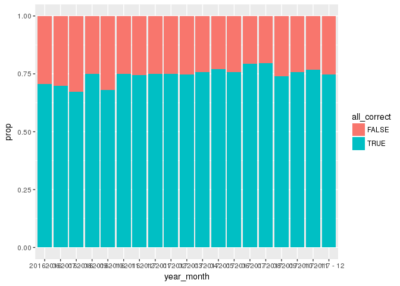

``` r
p <- LTS_yearmonth %>%
  filter(Type == "in") %>%
  group_by(id) %>%
  summarize(n = n()) %>%
  filter(n == 1) %>%
  select(id)
pp <- as.vector(p$id)
LTS_yearmonth %>%
  mutate(only_once = id %in% pp) %>%
  group_by(year_month, only_once) %>%
  distinct(id)  %>%
  summarize(n = n()) %>%
  mutate(prop = n/sum(n)) %>%
  ggplot(aes(x = year_month, y = n, fill = only_once)) + geom_col()+
  theme(axis.text.x = element_text(angle = 40, hjust = 1)) +
  ggtitle("Distribution of Total Users Each Month") +
  xlab("Year-Month") +
  ylab("Number of Users") +
  labs(fill= "Used only once") +
  theme(panel.grid.major = element_blank(), panel.grid.minor = element_blank(), panel.background = element_blank())
```

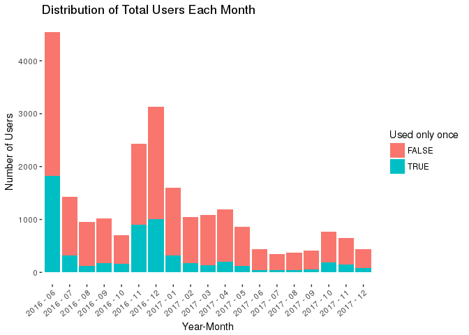

``` r
bb %>%
  mutate(Messages = ifelse(correct == TRUE & area_correct == "real", "Correct Format, Correct Area Code", 
                           ifelse(correct == TRUE & area_correct == "fake", "Incorrect Area Code, Correct Format", 
                                  ifelse(correct == FALSE & area_correct == "real", "Incorrect Format, Correct Area Code", "Incorrect Area Code, Incorrect Format")))) %>%
  group_by(year_month, Messages) %>%
  summarize(n = n()) %>%
  mutate(prop = n/sum(n)) %>%
  filter(Messages != "Correct Format, Correct Area Code") %>%
  ggplot(aes(year_month, prop, fill = Messages)) + geom_col() +
  theme(axis.text.x = element_text(angle = 40, hjust = 1)) +
  scale_fill_manual(values=c("tan1", "cadetblue4", "lightcoral")) +
  ggtitle("Proportion of Invalid Incoming Messages") +
  xlab("Year-Month") +
  ylab("Proportion") + 
  theme(panel.grid.major = element_blank(), panel.grid.minor = element_blank(), panel.background = element_blank())
```

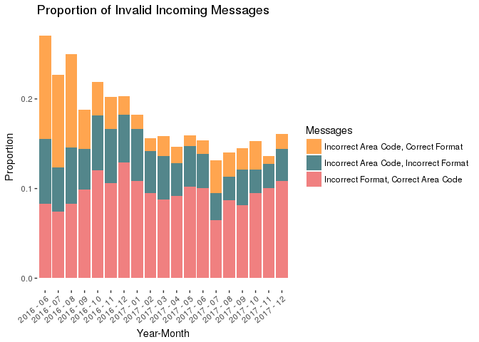

``` r
bb %>%
  mutate(Messages = ifelse(correct == TRUE & area_correct == "real", "Valid Messages", "Invalid Messages")) %>%
  filter(Type == "in") %>%
  group_by(year_month, Messages) %>%
  summarize(n = n()) %>%
  ggplot(aes(x = year_month, y = n, fill = Messages)) + geom_col() +
  theme(axis.text.x = element_text(angle = 40, hjust = 1)) +
  ggtitle("Distribution of Incoming Messages Each Month") +
  xlab("Year-Month") +
  ylab("Number of Requests") +
  theme(panel.grid.major = element_blank(), panel.grid.minor = element_blank(), panel.background = element_blank())
```

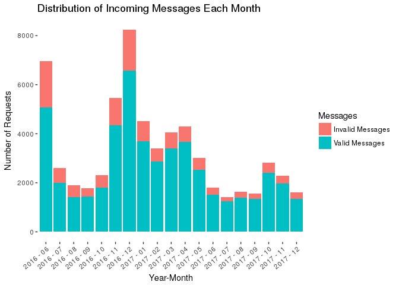

``` r
bb %>%
  group_by(year_month) %>%
  summarize(n = n()) %>%
  ggplot(aes(x = year_month, y = n)) + geom_col() +
  theme(axis.text.x = element_text(angle = 40, hjust = 1)) +
  ggtitle("Number of Requests Each Month") +
  xlab("Year-Month") +
  ylab("Number of Requests") +
  theme(panel.grid.major = element_blank(), panel.grid.minor = element_blank(), panel.background = element_blank())
```

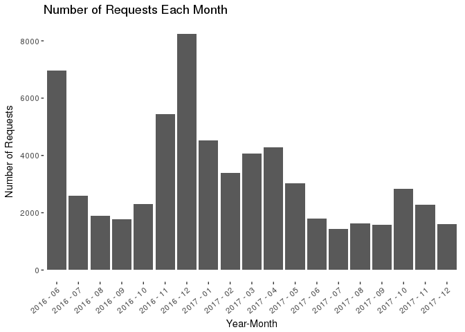

``` r
M <- bb %>%
  group_by(id) %>%
  summarize(n = n()) %>%
  filter(n == 1)
mm <- as.vector(M$id) 
bb %>%
  filter(id %in% mm) %>%
  group_by(correct, area_correct) %>%
  summarize(n = n()) %>%
  mutate(prop = n / sum(n))
```

    ## # A tibble: 4 x 4
    ## # Groups:   correct [2]
    ##   correct area_correct     n   prop
    ##   <lgl>   <chr>        <int>  <dbl>
    ## 1 F       fake           338 0.398 
    ## 2 F       real           511 0.602 
    ## 3 T       fake           389 0.0755
    ## 4 T       real          4760 0.924
