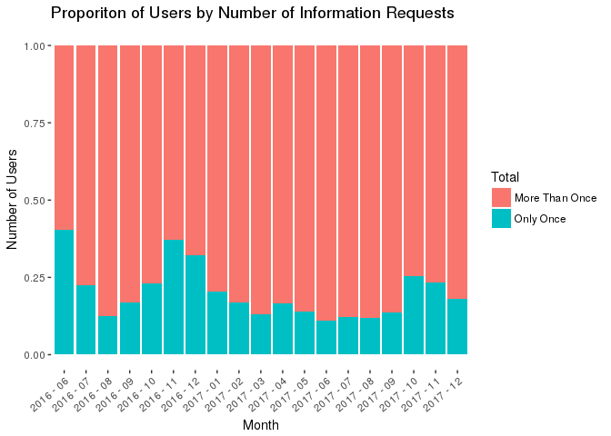
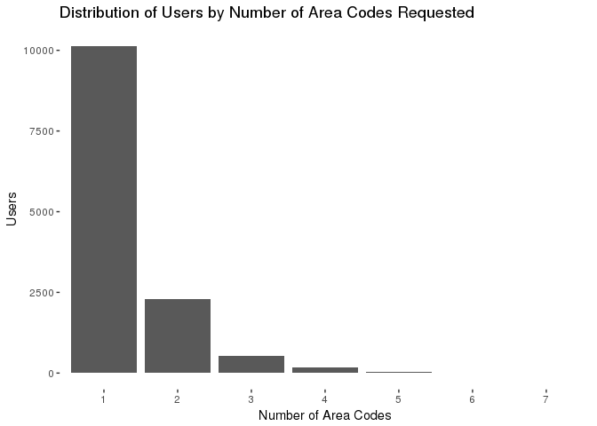
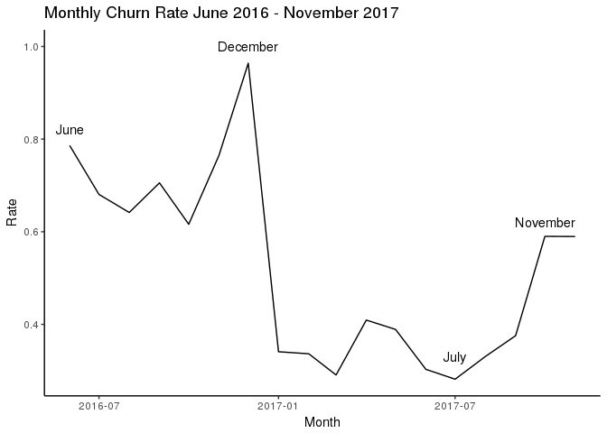

LTS-2 System: Exploratory Analysis of Service Usage Over Time and Space
================

Abstract:
---------

The goal of this project was to analyze spatio-temporal usage of Mercycorp Mongolia's LTS-2 SMS information system. We had three areas of focus in our analysis: request patterns of individual users, overall request patterns over time, and request patterns over time. Since the data set we worked with only covers an 18 month period, we are relatively limited in our ability to make conclusions about system usage over time and space. Still, there do appear to be patterns in requests sent into the system which may illustrate more general trends. Requests for information appear to increase in winter months (months cold enough for snow). Additionally, most users request information for only one or two area codes.

The System:
-----------

The LTS-2 system is an SMS information service designed to help Mongolian Nomadic herders to improve lives outcomes. The service works by providing weather forecast and pasture information to herders by text message. Anyone with a Mongolian phone number can text into the system, though the information provided is tailored for nomadic herders. In particular, the system aims to reduce livestock deaths due to severe weather, and ensure long-term sustainability of herding by reducing overgrazing.

The SMS service provides weather and pasture information via text message. One to three, and four day forecasts are available, in addition to pasture information pulled from the Livestock Early Warning system run by Texas A&M University. To receive a text message response, users must request information for a specific *bagh* (Mongolian sub-district). The data we analyzed is comprised of all the incoming and outgoing texts associated with the LTS-2 system. Incoming texts consist of a *bagh*-level area code and an integer from 1-3 indicating request type. 1 and 2 represent one- to three-day and four- to six-day forecast respectively, while 3 represents a request for pasture information. The format of an incoming text must conform to fairly strict rules for a user to receive a response. The text must contain a 5 digit *bagh* area code, followed by at least one space, and end with the request code. Any change in formatting, or addition of other information will mean a user does not receive a response. In general, outgoing weather forecasts contain the starting date of the forecast interval, one of four predicted meteorological conditions (sun, clouds, rain, snow). When available, higher resolution forecasts that include high and low temperature are provided.

The Data:
---------

As described above the system is comprised of incoming and outgoing messages in the system. Due to the system’s cataloging method, the dataset does not contain a response for every request, or a request for every response. The first is due to user error. Improperly formatted messages are catalogued but do not receive a response. The second, is a system error. In the dataset, outgoing messages sent to phantom phone numbers appear to be messages sent to phone numbers that never sent requests for information; however, these phantom messages are actually due to transcription errors in the system’s data collection method. No messages were were sent out. An update to the system in the fall of 2016 mostly solved the problem. These phantom messages appear only infrequently after September 2016.

The raw data we analyzed contained 125,000 observations spanning from June of 2016 to December of 2018. Observations were of individual messages, either ingoing and outgoing, and contained five variables: telephone number, date, time, message, and message type (incoming/outgoing). Since telephone numbers are traceable to individuals, we replace telephone numbers with random unique identifiers. There are a roughly equivalent number of incoming and outgoing messages, with 61,000 incoming messages and 63,000 outgoing.

| I.D.  | Date       | Times    | Type | Message          |
|-------|------------|----------|------|------------------|
| 14278 | 2017-04-01 | 08:11:21 | In   | 62267 2          |
| 14278 | 2017-04-01 | 08:12:17 | Out  | 4sar4: uurlerheg |
| 24056 | 2017-04-01 | 08:18:57 | In   | 23177 2          |
| 24056 | 2017-04-01 | 08:19:18 | Out  | 4sar4: uulerheg  |
| 50171 | 2017-04-01 | 08:36:27 | In   | 62131 1          |
| 50171 | 2017-04-01 | 08:37:25 | Out  | 4sar1: uulerheg  |

**Fig. 1** Several lines of the de-identified, raw dataset.

Analysis:
---------

Our analysis of the LTS-2 dataset focused identifying and describing patterns in system usage over time and space. In addition to generally describing patterns in system usage, the following analysis looks at the characteristics of individual users, with some attention to user and system errors. Our analysis included mapping of spatial usage of the system over time using an interactive shiny dashboard. The shiny dashboard creates an interactive map that displays the number of requests from each area code. Users can filter the displayed requests by specify a time interval or request type.

In analyzing the ways the system is used, we focused on three major areas. First, characterizing the average user. Second, describing in general trends in system usage over time, and finally looking at the spatial distribution of usage.

### Individual Users:

    ## Warning: Missing column names filled in: 'X1' [1]

    ## Parsed with column specification:
    ## cols(
    ##   X1 = col_integer(),
    ##   id = col_integer(),
    ##   Date = col_date(format = ""),
    ##   Time = col_datetime(format = ""),
    ##   Type = col_character(),
    ##   Message = col_character()
    ## )

    ## # A tibble: 1 x 1
    ##       n
    ##   <int>
    ## 1 56142

    ## # A tibble: 1 x 1
    ##       n
    ##   <int>
    ## 1 13239

We began by characterizing the average user. To do this, we assumed that each telephone number corresponds to an individual users, and that individual users did not switch telephone numbers or swap phones. In total, 13,239 different telephone numbers, which we assigned random unique identifiers, requested information from the system between June 2016 and December 2017. The majority of these users requested information relatively few times.

| Mean | Median | Min | Max |
|------|--------|-----|-----|
| 4.63 | 2      | 1   | 492 |

**Table 1** Descriptive statistics of the number of the distribution of times individual users requested information.

The above table shows the descriptive statistics of the distribution of the number of times individual users requested information. With a mean of 4.63 and median of 2, the distribution of the number of requests by individual users, suggesting that many of the system’s phone numbers request information only a few times.

    ## # A tibble: 19 x 4
    ## # Groups:   year_month [19]
    ##    year_month usage         n  prop
    ##    <chr>      <chr>     <int> <dbl>
    ##  1 2016 - 06  Only Once  1828 0.403
    ##  2 2016 - 11  Only Once   905 0.372
    ##  3 2016 - 12  Only Once  1007 0.321
    ##  4 2017 - 10  Only Once   194 0.253
    ##  5 2017 - 11  Only Once   151 0.232
    ##  6 2016 - 10  Only Once   162 0.229
    ##  7 2016 - 07  Only Once   321 0.225
    ##  8 2017 - 01  Only Once   325 0.204
    ##  9 2017 - 12  Only Once    79 0.181
    ## 10 2017 - 02  Only Once   176 0.169
    ## 11 2016 - 09  Only Once   170 0.167
    ## 12 2017 - 04  Only Once   199 0.167
    ## 13 2017 - 05  Only Once   120 0.140
    ## 14 2017 - 09  Only Once    56 0.135
    ## 15 2017 - 03  Only Once   141 0.129
    ## 16 2016 - 08  Only Once   119 0.126
    ## 17 2017 - 07  Only Once    43 0.122
    ## 18 2017 - 08  Only Once    45 0.120
    ## 19 2017 - 06  Only Once    49 0.111

**Fig. 2** This bar plot represents the distribution of the proportion of unique users each month, separated into single-time users (blue) and users who requested information more than one time (red). Note that users counted in the red bar in one month may also be counted in the red bars in subsequent months.

The graph above shows the monthly proportion of single-time versus multi-time users. Based on this distribution, a significant proportion and consistent proportion of users appear to text into the LTS-2 system and then never request more information. The maximum proportion was in June 2016, at 40% with a minimum of 11% in June 2017. The peak in single-time users around November 2016 (37%) suggests an influx of new, single-time users, and is mirrored in a smaller peak around October/November 2017 (25 and 23% respectively). Any conclusion about seasonal usage is difficult given the newness of the LTS system, though the apparent trend seems to be towards fewer non-repeat users in the summer months (June, July, August, and September).

    ## # A tibble: 2 x 2
    ##   usage              n
    ##   <chr>          <int>
    ## 1 More Than Once  7241
    ## 2 Only Once       5998

| Usage Type     | Number of Users |
|----------------|-----------------|
| Total          | 13239           |
| Once           | 5998            |
| More Than Once | 7241            |

**Table 2** Table of the number users who either requested information one time or more than one time compared to the total number users.

To have a sense for the actual number of users who only used the system once, we generated the above table, which shows that there is a significant number of people who requested information a single time.

**Fig. 3** Counts of requests for each of the three types of information offered by the LTS-2 system represented by an integer between 1 and 3. 1 represents a request for a 1-3 day forecast, 2 represents a 4-6 day forecast, and 3 a pasture information.

Users seem mostly interested in weather information. Of the approximately 52,000 correctly formatted messages (messages that contain only a five-digit area code, and a request code between 1 and 3), about 36,000 were for 1-3 day weather forecasts and 14,000 were for 4-6 day weather forecasts. In comparison, only about 1300 requests for pasture information, suggesting that weather information is the main type of information users are interested in.

    ## # A tibble: 33 x 2
    ##        n    nn
    ##    <int> <int>
    ##  1     1 10142
    ##  2     2  2281
    ##  3     3   523
    ##  4     4   170
    ##  5     5    49
    ##  6     6    15
    ##  7     7    13
    ##  8     8     2
    ##  9     9     3
    ## 10    10     4
    ## # ... with 23 more rows

**Fig. 4** The distribution of number of area codes requested by service users. Most users only requested information about a single area code in the course of their use of the system.

The above bar plot shows the distribution of the number of area codes for which users requested information. Most users only requested information for one area code (around 10,000) in their spans of their . Number of area codes drops off significantly after that, with about 2,500 users requesting 2. It’s difficult to know whether this pattern is at all related to the geographical location of users, because many users only queried the system a single time; however, using the shiny dashboard mapping geographical usage, it’s possible to gain some insight into the spatial distribution of users. A general examination of the dashboard shows that requests are concentrated in the northern parts of the country. Apart from several southern area codes that receive a significant number of requests, there are almost no southern locations that receive forecast requests.

**Fig. 5** Proportion of incoming messages that were incorrectly formatted and/or contained area codes that do not correspond real area codes.

The graph above shows the proportions of invalid messages each month, which are caused by incorrectly formatting and/or area codes that do not correspond to actual places. We see an overall decreasing pattern in the total proportion of invalid requests. The monthly proprotion of incoming messages that were incorrectly formatted or contained incorrect information ranged from a maximum of 27% in June of 2016 to a minimum of 13% in July of 2017. The above graph shows that breaking down the invalid messages by type indicates that incorrect formatting was both the most common and most consistent problem in user error. The proportion of messages with incorrect formatting appeared not change much over time, while the use of non-existing area codes in messages tended to decrease.

Users were creative in their formatting of messages. Incorrect messages involved anything from requests for multiple types of information at a time or multiple area codes at a time, to entire sentences describing the information a user wanted. Given the relatively high proportion of incorrectly formatted messages over time, it may be helpful for the service to respond with formatting instructions to any unreadable messages. Currently, incorrectly formatted messages do not receive a response, so providing a response to incorrectly formatted messages may improve users’ interactions with the system.

**Conclusion**

Analyzing the above visualizations and tables describing the ways individual users queried the system, a number of trends stand out. The first, given a mean 4.63 requests and a median of 2 requests per unique id, is that most users used the system a small number of times. Second, many users only query the system a single time, with monthly proportions of single-time users ranging between 11 and 40% between June 2016 and December 2017. Additionally, we found the majority of users only request information for a single area code. This observation may in part be due to the fact that many users only request information a single time. Finally, we found that incorrectly formatting message is a common user error, and is consistent over time. Focusing attention on improving user understanding of the system may improve peoples' experience with the system.

General Usage Patterns:
-----------------------

To get a better understanding of the ways users enter and exit the system, and to understand aggregate usage patterns, we focused on temporal usage.

    ## # A tibble: 19 x 5
    ## # Groups:   month [12]
    ##    month  year     n total churn
    ##    <dbl> <dbl> <int> <int> <dbl>
    ##  1 12.0   2017   435   435 1.00 
    ##  2 12.0   2016  2937  3047 0.964
    ##  3  6.00  2016  2731  3474 0.786
    ##  4 11.0   2016  1826  2387 0.765
    ##  5  9.00  2016   448   635 0.706
    ##  6  7.00  2016   686  1008 0.681
    ##  7  8.00  2016   392   611 0.642
    ##  8 10.0   2016   435   706 0.616
    ##  9 10.0   2017   449   761 0.590
    ## 10 11.0   2017   378   641 0.590
    ## 11  4.00  2017   487  1190 0.409
    ## 12  5.00  2017   326   838 0.389
    ## 13  9.00  2017   151   402 0.376
    ## 14  1.00  2017   539  1581 0.341
    ## 15  2.00  2017   350  1040 0.337
    ## 16  8.00  2017   124   375 0.331
    ## 17  6.00  2017   133   439 0.303
    ## 18  3.00  2017   314  1080 0.291
    ## 19  7.00  2017    98   348 0.282

**Fig. 6** Time series plot of the monthly churn rate, which is a measure of turn over in users of a given system.

Since the dataset covers a relatively short period of time, we calculated monthly churn rates by dividing the number of users who used the system for the last time in a given month by the total number of users that month. The timeplot below shows this churn rate over time. Since we have no data for January 2018, December 2017 was excluded in the analysis. The system’s churn rate was relatively high, indicating that people are constantly entering and exiting the system. 2016 had consistently high churn rates, with a range between 60% and 80% between June and November of 2016, peaking in December at 96%, which was the highest churn rate throughout the year. Relative to 2016, 2017 saw low churn rates, with a range from 28% in July to 59% in October.

    ## Warning: Missing column names filled in: 'X1' [1]

    ## Parsed with column specification:
    ## cols(
    ##   X1 = col_integer(),
    ##   id = col_integer(),
    ##   Date = col_date(format = ""),
    ##   Time = col_datetime(format = ""),
    ##   Type = col_character(),
    ##   Message = col_character(),
    ##   info_type = col_character(),
    ##   weather = col_character(),
    ##   weather_eng = col_character()
    ## )

**Fig. 7** Bar plot of counts of monthly outgoing messages coded for forecasted meteorological conditions.

The above plot shows shows the distribution of weather types in outgoing forecasts by month. This graph uses the type weather forecasted - clouds, rain, snow, or sun - as an indicator of Mongolian weather patterns during a given month. While this provides only a rough sense of actual weather patterns, there does appear to noticeable seasonal patterns in types of weather forecasts, with snow forecasted in late fall into winter and early spring, and rain in spring/summer. Usage patterns appear to rise and fall with the appearance of snow, increasing in winter and dipping in summer. June 2016 has relatively high usage, though, is likely an outlier because the system started operation that month.

**Fig. 8** Time series plot of the number of new users per month and number of requests per month.

The above time series of number of requests per month overlaid with number of new users per month, shows that new users and requests map fairly well onto each other. Spikes in usage of the system often occur at the same time as new users join the service. This seems to indicate that the existing users request information at a variable rate, as is demonstrated by the peak during March of 2017. This peak in queries is not associated with a spike in new users, further demonstrating the fact that existing users request information at variable rates. In other words, at some times of year existing users, as a whole, queried the system more than at other times of year. Still, the plots seem to map fairly well onto each other. From this we conclude that there may be a trend in usage over time, but the time frame is too short to determine what processes might be behind that trend.

We expected to see a seasonal cycle in the usage of the LTS-2 system due to the seasonal nature of nomadic herding. The LTS-2 system experienced a usage spike during the winter of 2016. However, while there was also an uptick in requests during the winter of 2017, it was of a significantly smaller magnitude. Our plot of requests per month (fig \#) and number of users per month (fig \#) above shows that usage during the summer months seems fairly consistent, and low from 2016 to 2017. Though it's difficult to discern whether there is a seasonal pattern in usage, there does appear to be a some relationship between snow and number of requests. Our weather analysis relied on the forecast information contained within the LTS outgoing messages, so we were only able look at weather patterns at low-resolution. Snow may be a covariate to cold weather, so future analysis should look at the effects of storms versus cold weather on system usage.

Conclusion:
-----------

We analyzed spatial and temporal usage of the LTS-2 system in two areas: individual users, and aggregate usage. Temporal analysis showed a seasonal spike in usage during the winter season (November to February/March). We also found that usage of the system decreased from 2016 to 2017, with the system receiving more requests in the fall and winter of 2016 as compared to the fall and winter of 2017. Though both seasons saw spikes, the spike in 2016 was much higher than in 2017. The system received 8239 requests in December 2016, compared to the peak that occurred late in 2016, which was 2830 requests in October of 2017. Additionally, we found that the locations system users request information for tended to be fairly static. Most users only requested forecasts for one or two area codes. Our most interesting insight comes from examining user behavior. We find that requests for weather forecasts significantly outnumber requests for pasture information, suggesting that system users are more interested in weather information - particularly short-term forecasts - than in information about pasture cover. Users also seem to struggle with properly formatting requests for information. Adding an error message function to the system, in which invalid messages receive a response with instructions for correct formatting, may be a useful feature.
